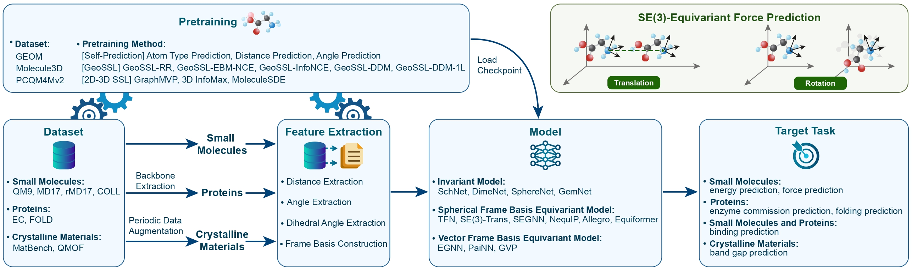

# Symmetry-Informed Geometric Representation for Molecules, Proteins, and Crystalline Materials

Authors: Shengchao Liu, Weitao Du, Yanjing Li, Zhuoxinran Li, Zhiling Zheng, Chenru Duan, Zhiming Ma, Omar Yaghi, Anima Anandkumar, Christian Borgs, Jennifer Chayes, Hongyu Guo, Jian Tang

This is **Geom3D**, a platfrom for geometric modeling on 3D structures:
<p align="center">
   
</p>

## Environment

### Conda

Setup the anaconda
 ```bash
wget https://repo.continuum.io/archive/Anaconda3-2019.10-Linux-x86_64.sh
bash Anaconda3-2019.10-Linux-x86_64.sh -b
export PATH=$PWD/anaconda3/bin:$PATH
 ```

### Packages
Start with some basic packages.
```bash
conda create -n Geom3D python=3.7
conda activate Geom3D
conda install -y -c rdkit rdkit
conda install -y numpy networkx scikit-learn
conda install -y -c conda-forge -c pytorch pytorch=1.9.1
conda install -y -c pyg -c conda-forge pyg=2.0.2
pip install ogb==1.2.1

pip install sympy

pip install ase

pip install lie_learn # for TFN and SE3-Trans

pip install packaging # for SEGNN
pip3 install e3nn # for SEGNN

pip install transformers # for smiles
pip install selfies # for selfies

pip install atom3d # for Atom3D
pip install cffi # for Atom3D
pip install biopython # for Atom3D

pip install cython # for pyximport 

conda install -y -c conda-forge py-xgboost-cpu # for XGB
```

## Datasets

We cover three types of datasets:
- Small Molecules
    - QM9
    - MD17
    - rMD17
    - COLL
- Proteins
    - EC
    - FOLD
- Small Molecules and Proteins
    - LBA
    - LEP
- Materials
    - MatBench
    - QMOF

For dataset acquisition, please refer to the [data](./data) folder.

## Representation Models

Geom3D includes the following representation models:
- [SchNet, NeurIPS'18](https://papers.nips.cc/paper_files/paper/2017/hash/303ed4c69846ab36c2904d3ba8573050-Abstract.html)
- [TFN, NeurIPS'18 Workshop](https://arxiv.org/abs/1802.08219)
- [DimeNet, ICLR'20](https://openreview.net/forum?id=B1eWbxStPH)
- [SE(3)-Trans, NeurIPS'20](https://proceedings.neurips.cc//paper/2020/hash/15231a7ce4ba789d13b722cc5c955834-Abstract.html)
- [EGNN, ICML'21](http://proceedings.mlr.press/v139/satorras21a.html)
- [PaiNN, ICML'21](https://arxiv.org/abs/2102.03150)
- [GemNet, NeurIPS'21](https://proceedings.neurips.cc/paper/2021/hash/35cf8659cfcb13224cbd47863a34fc58-Abstract.html)
- [SphereNet, ICLR'22](https://openreview.net/forum?id=givsRXsOt9r)
- [SEGNN, ICLR'22](https://openreview.net/forum?id=_xwr8gOBeV1)
- [NequIP, Nature Communications'22](https://www.nature.com/articles/s41467-022-29939-5)
- [Allegro, Nature Communications'23](https://www.nature.com/articles/s41467-023-36329-y)
- [Equiformer, ICLR'23](https://openreview.net/forum?id=KwmPfARgOTD)
- [GVP-GNN, ICLR'21](https://openreview.net/forum?id=1YLJDvSx6J4)
- [IEConv, ICLR'21](https://openreview.net/forum?id=l0mSUROpwY)
- [GearNet, ICLR'23](https://openreview.net/forum?id=to3qCB3tOh9)
- [ProNet, ICLR'23](https://openreview.net/forum?id=9X-hgLDLYkQ)
- [CDConv, ICLR'23](https://openreview.net/forum?id=P5Z-Zl9XJ7)

We also include the following 7 1D models and 11 2D models (specifically for small molecules):
- 1D Fingerprints: MLP, RF, XGB
- 1D SMILES: CNN, BERT
- 1D Selfies: CNN, BERT
- 2D topology:
    - [GCN, NeurIPS'2015](https://arxiv.org/abs/1509.09292)
    - [ENN-S2S, ICML'17](https://arxiv.org/abs/1704.01212)
    - [GraphSAGE, NeurIPS'17](https://arxiv.org/abs/1706.02216)
    - [GAT, ICLR'2018](https://openreview.net/forum?id=rJXMpikCZ)
    - [GIN, ICLR'2019](https://openreview.net/forum?id=ryGs6iA5Km)
    - [D-MPNN, ACS-JCIM'2019](https://pubs.acs.org/doi/10.1021/acs.jcim.9b00237)
    - [N-Gram Graph, NeurIPS'2019](https://arxiv.org/abs/1806.09206)
    - [PNA, NeurIPS'2020](https://arxiv.org/abs/2004.05718)
    - [Graphormer, NeurIPS'21](https://openreview.net/forum?id=OeWooOxFwDa)
    - [AWARE, TMLR'2022](https://openreview.net/forum?id=TWSTyYd2Rl)
    - [GraphGPS, NeurIPS'22](https://arxiv.org/abs/2205.12454)

Notice that there is no pretraining considered at this stage. For geoemtric pretraining models, please check the following section.

## Geometric Pretraining

We include the following 14 geometric pretraining methods:

- Pure 3D:
    - Supervised
    - Atom Type Prediction
    - Distance Prediction
    - Angle Prediction
    - 3D InfoGraph, from [GeoSSL, ICLR'23](https://openreview.net/forum?id=CjTHVo1dvR)
    - GeoSSL-RR, from [GeoSSL, ICLR'23](https://openreview.net/forum?id=CjTHVo1dvR)
    - GeoSSL-InfoNCE, from [GeoSSL, ICLR'23](https://openreview.net/forum?id=CjTHVo1dvR)
    - GeoSSL-EBM-NCE, from [GeoSSL, ICLR'23](https://openreview.net/forum?id=CjTHVo1dvR)
    - [GeoSSL-DDM, ICLR'23](https://openreview.net/forum?id=CjTHVo1dvR)
    - [GeoSSL-DDM-1L, ICLR'23](https://openreview.net/forum?id=tYIMtogyee)
    - [3D-EMGP, AAAI'23](https://arxiv.org/abs/2207.08824)
- Joint 2D-3D:
    - [GraphMVP, ICLR'22](https://openreview.net/forum?id=xQUe1pOKPam)
    - [3D InfoMax, ICML'22](https://proceedings.mlr.press/v162/stark22a.html)
    - [MoleculeSDE, ICML'23](https://arxiv.org/abs/2305.18407)
